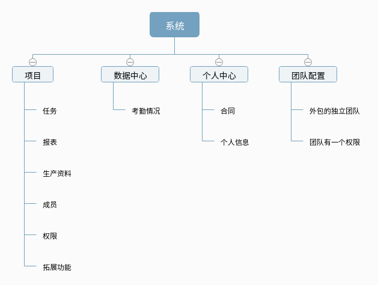

# my-project2


## 0.😔
> 爱江山，更爱美人 
> 哪个英雄好汉宁愿孤单 
> 好儿郎　浑身是胆 
> 壮志豪情四海远名扬 
> 人生短短几个秋啊 
> 不醉不罢休
## 1.使用的插件

- vuex          -- 状态管理
- vue-router    -- 路由
- vue-resource  --http
- element-ui    --界面
- 待补充   

## 2.路径图


## 3.主要目录介绍
```
src
 ├ assets
 ├ components                   // 组件
 │    ├ Common                  // 公共模块 比如自定义按钮什么额
 │    ├ Header                  // 存放头部
 │    ├ Project                 // projectItem.vue
 │    ├ Task                    // tasklist taskstate
 │    └ ....
 │
 ├ pages
 │    ├ mainPage.vue            // 首页
 │    ├ Login                   // 登陆
 │    ├ My                      // 我的
 │    ├ project                 // 项目
 │    │   ├ projectList.vue     // 项目列表
 │    │   ├ projectDetails.vue  // 项目详情
 │    │   └ ProjectDetails      // 项目任务、考勤等
 │    ├ Register                // 注册
 │    ├ Search                  // 搜索
 │    └ ....
 ├ router
 │    └ index.js
 ├ store
 │    ├ index.js                // 主模块
 │    └ modules
 │       ├  attendanceIndex.js  // 考勤模块
 │       ├  staffIndex.js       // 人员模块
 │       ├  taskIndex.js        //任务模块
 │       └ ....
 ├ App.vue
 └ main.js
```

## 4.Build Setup

``` bash
# install dependencies
npm install

# serve with hot reload at localhost:8080
npm run dev

# build for production with minification
npm run build

# build for production and view the bundle analyzer report
npm run build --report

# run unit tests
npm run unit

# run e2e tests
npm run e2e

# run all tests
npm test
```

For a detailed explanation on how things work, check out the [guide](http://vuejs-templates.github.io/webpack/) and [docs for vue-loader](http://vuejs.github.io/vue-loader).

## 5.代码格式
### 变量名
 小驼峰式：(little camel-case)
 第一个单词首字母小写，后面其他单词首字母大写。

### 文件名or函数名
> 大驼峰式：(big camel-case)
每个单词的第一个字母都大写;

# 6.任务列表

### 课程
- [ ] 增、删、改、查

### 学生
- [ ] 增、删、改、查
### 考勤
- [ ] 增、改、查
- [ ] 缺课统计
### 作业
- [ ] 增、删、改、查
- [ ] 作业提交统计
### 成绩
- [ ] 成绩录入
- [ ] 成绩统计


